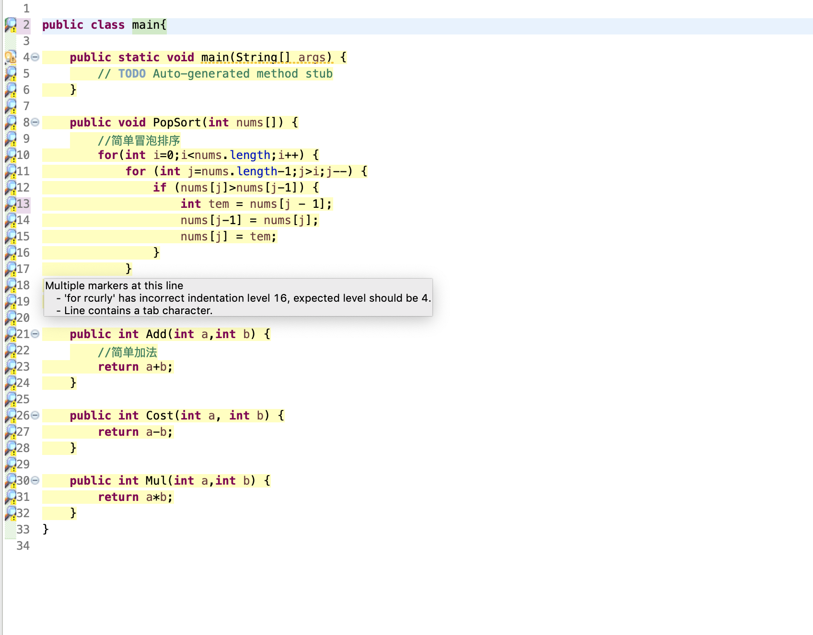
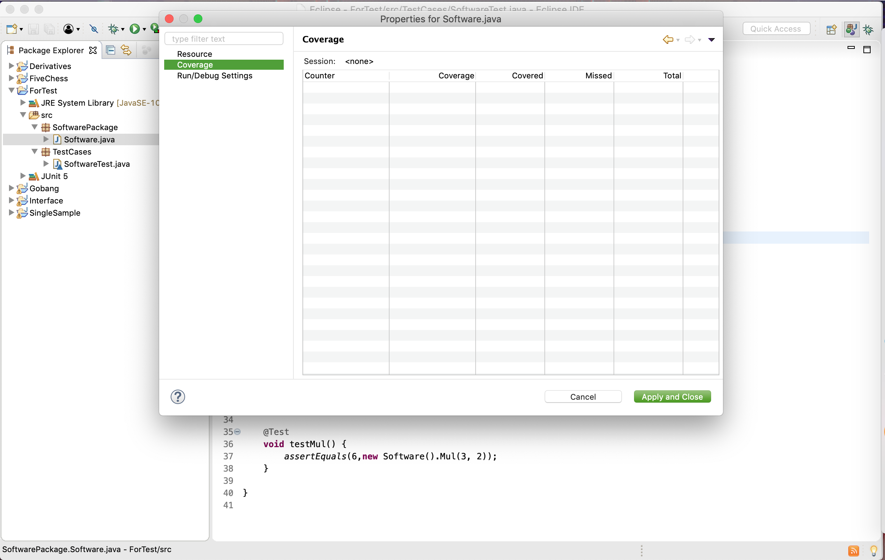
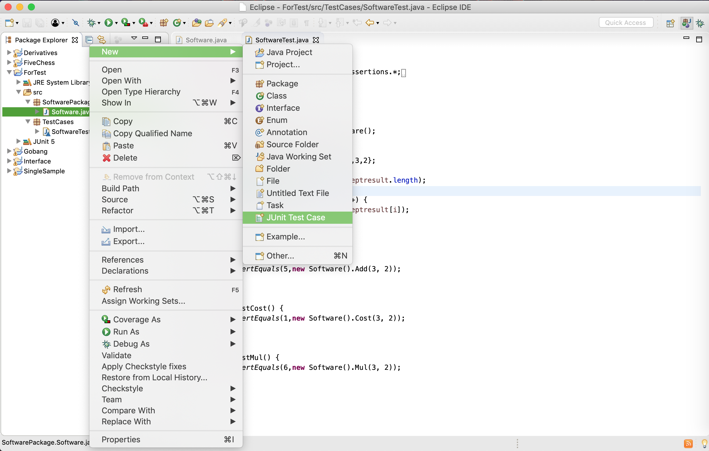
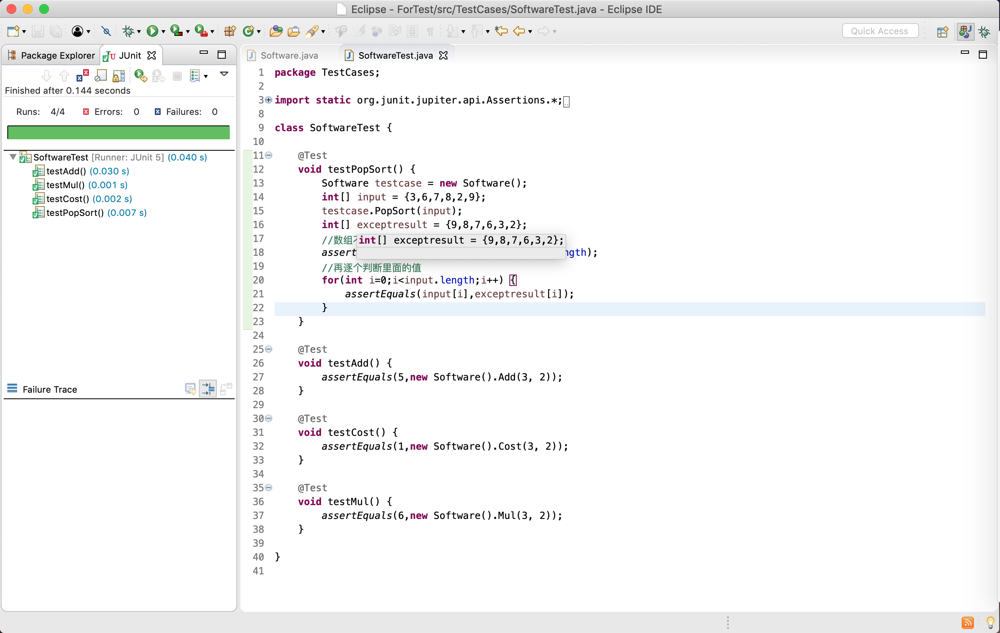

# 测试文档

## 静态测试

直接照着[IBM官网](https://www.ibm.com/developerworks/cn/java/j-ap01117/index.html)一顿梭哈,发现还有很多问题譬如装上了有些运行不了的问题,要么就是网址下不下来.....目前为止只装了**CheckStyle**和**Coverlipse**.(~~有点懒~~)

**CheckStyle**具体效果图如下:

**Coverlipse**具体如下:

## 单元测试

单元测试就比较简单,写函数然后建了对应的测试类:

照着[博客](https://blog.csdn.net/fulishafulisha/article/details/80158392)写完了对应的测试样例就差不多ok了,比较麻烦的数组的比较得先比较对应的长度大小,再比较对应的内容,直接比较会因为[数组地址](https://bbs.csdn.net/topics/390657835)不一样而报错.简简单单的AC:

