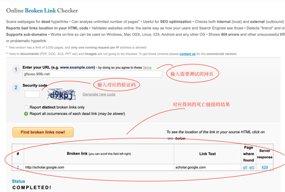
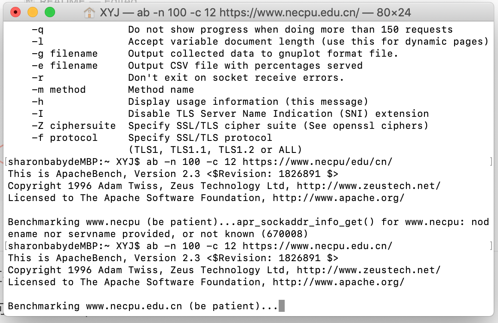
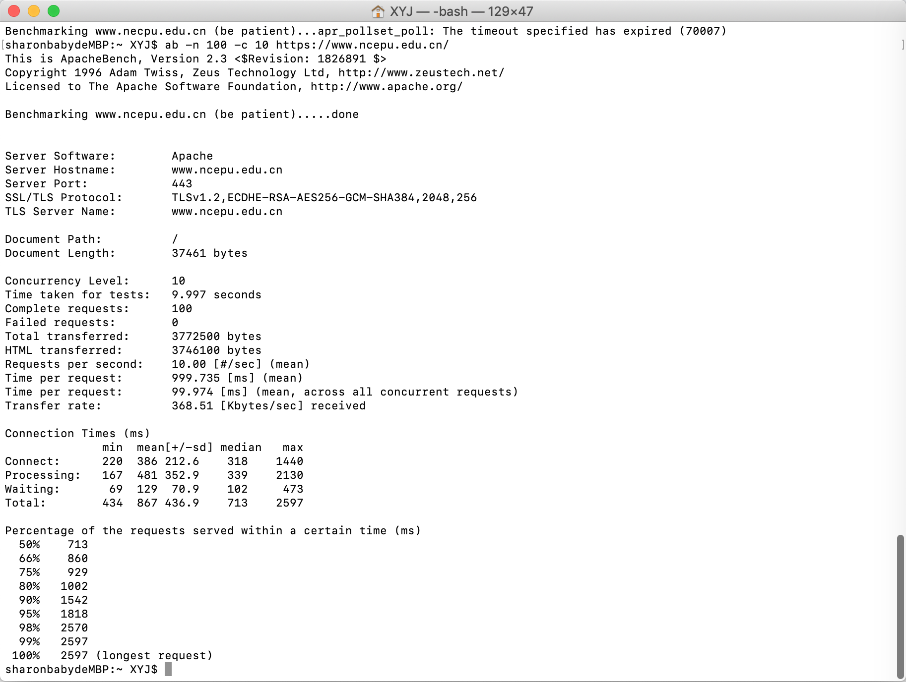

# Web测试部分

## Web链接测试

考虑到一些网站上的链接有可能会存在一些链接无法访问的情况,对此我们采用对应的链接测试工具进行测试.这里我们选取了**Broken Link Checker**来对死链接进行一个测试.

通过输入对应的网站就可以对网站内部的所有链接进行一个测试.

## 性能压力测试

性能压力测试这块我们直接采用Mac系统下的对应的测试软件ApacheBench

采用"apachectl -v"命令可以查看当前ApacheBench的版本.

随后可以根据对应的“ab -n 并发数 -c 请求数 URL”命令对对应的网站进行测试.

我们对https://www.ncepu.edu.cn/进行测试,

首先会进入一段比较长的等待时间:

最后得到的对应测试数据如下:

如图所示,我们可以看到对应的测试端口号,以及每个请求花费的时间,完成的请求数目等.

对应的一些比较重要的参数罗列如下:

吞吐率（Requests per second）

并发连接数（The number of concurrent connections）

用户平均请求等待时间（Time per request）

服务器平均请求等待时间（Time per request:across all concurrent requests）

# 参考资料

[Mac下的Web性能压力测试工具:ab(ApacheBench)](https://www.cnblogs.com/liuyu2014/p/11855681.html)