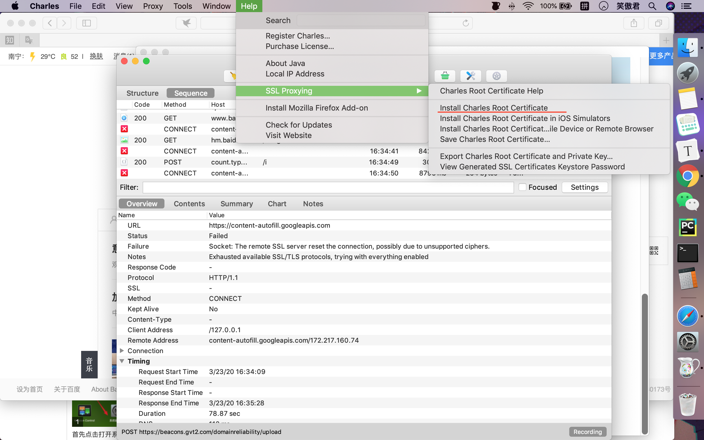
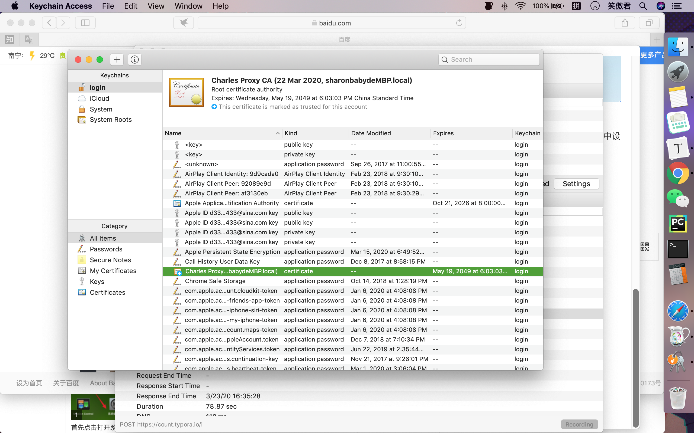
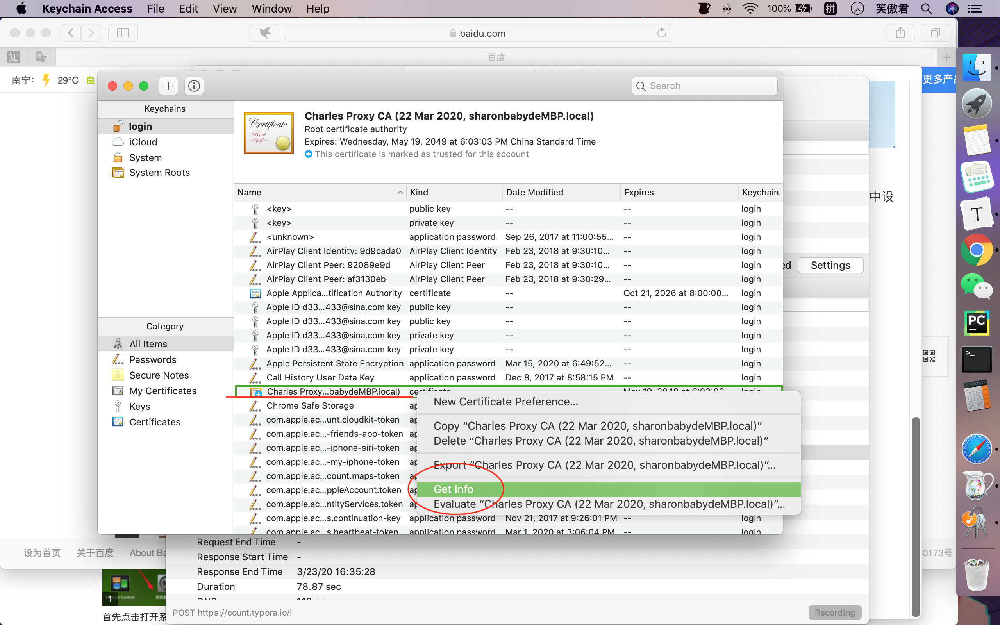
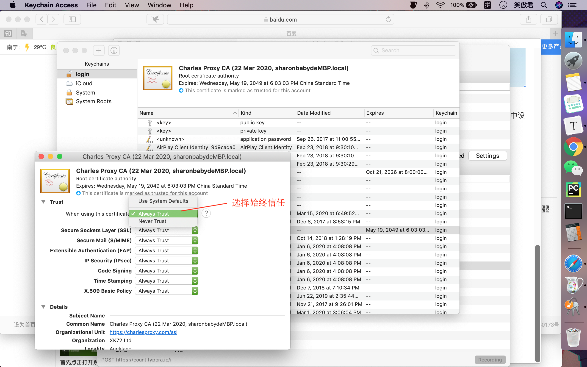
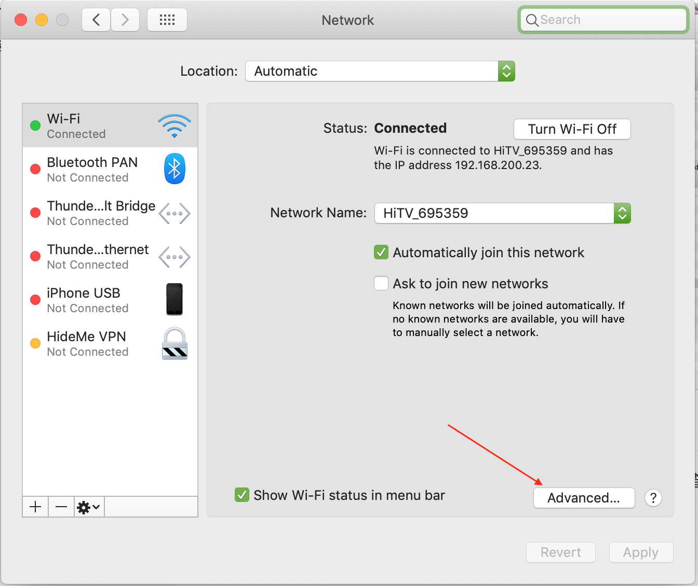
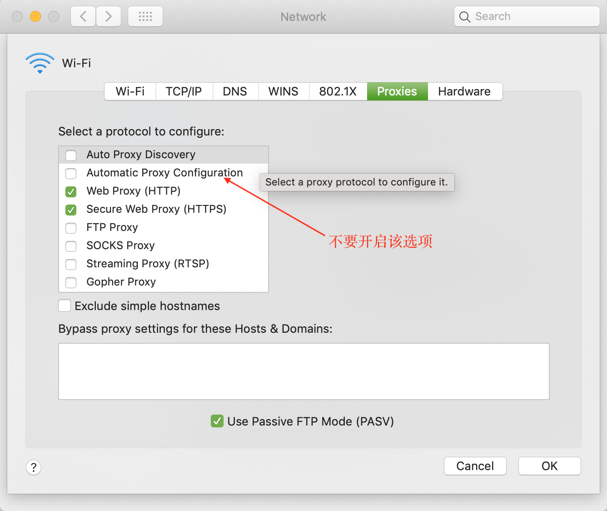
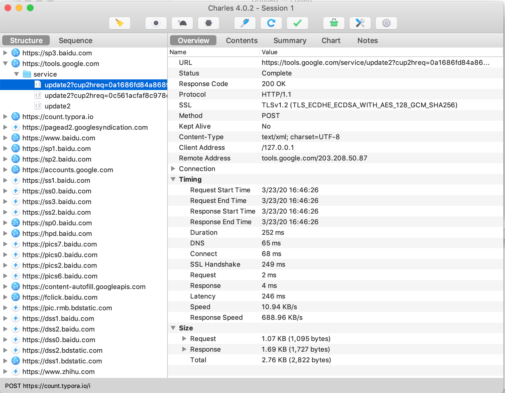

# Charles软件安装及使用

## Charles简介

Charles是Mac操作系统下的常用的抓包工具,在做移动端开发的时候,为了我们为了调试与服务器端的网络通讯协议，常常需要截取网络封包来分析.

## Charles安装

从[官网](https://www.charlesproxy.com/)直接下载软件有30天的试用期,可以考虑破解版,并安装到电脑上即可.需要注意的是,安装完成之后需要把软件移动到应用

## 证书授权

然后对应的要给我们的Charles安装证书.在软件左上角点击Help----SSL Proxying----Install Charles Root Certificate安装对应的证书,当然你也可以选择从官网上下载对应的证书.

下载完证书会弹出对应的证书窗口,这时候证书可能因为没有呗计算机信任而未必能用,这时候需要我们点进去给证书添加信任,选中对应的证书,点击==GetInfo==查看内容,同时选择==始终相信==该证书.这下子证书就配置好了.

## 代理管理

尽管做完了上面的工作,我的Charles依旧没有任何反应,查了很久才查到是对应的代理不可以选择自动选择.需要重新在==wifi处==设置.首先选择对应的网络设置.

点击对应的==高级功能==.在高级功能里面选择对应的关闭下面的自动设置代理的选项.

至此咱们就可以放心的使用Charles了.

## 具体效果

在Charles中选择Proxy---Mac os Proxy,同时开始录制即可.不一会就录制下了很多对应服务器和本地的交互信息,包括对应的URL和数据内容等.

当然同样的你也可以模拟客户端对目标服务器发送GET,POST等http协议请求.

## 简单原理分析

实际上不难理解,Charles就是拿了个假的证书,把原本仅仅属于客户端的数据包截取了下来,这样就可以对于客户端收到的数据进行一个全面的分析.

http/https最大的不同主要在于https不再是明文传输,而是采用了对应的证书加密方式.从而使得数据包不会被中途截获.而得到了信任的Charles则可以无视这一点,直接获取对应的数据包并分析.

## 参考文献

[Charles网络抓包工具的使用介绍](https://www.jianshu.com/p/93ef09fd299e)
[浅谈Charles抓取HTTPS原理](https://www.jianshu.com/p/405f9d76f8c4)
[charles使用教程](https://blog.csdn.net/forebe/article/details/98945139)

