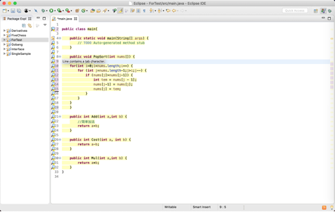
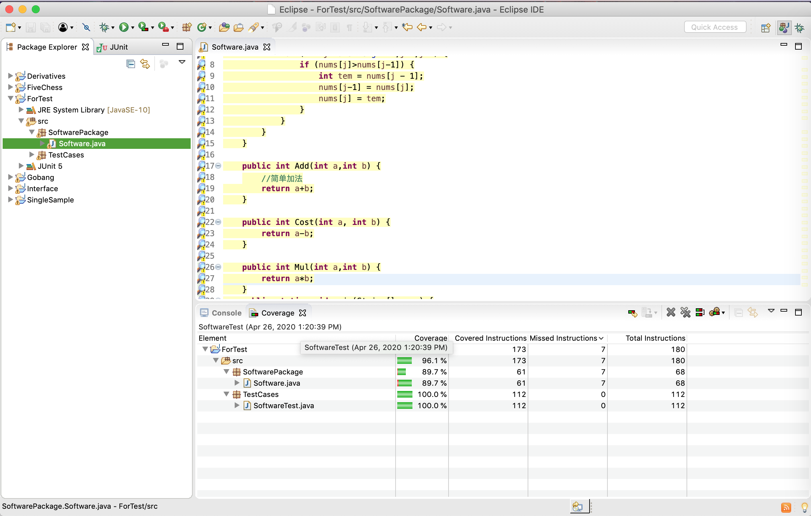
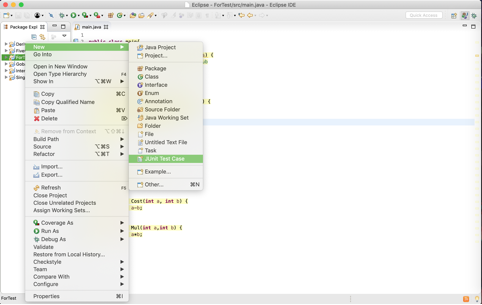
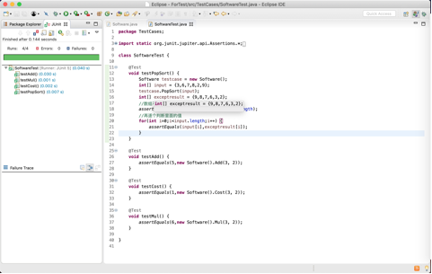

# 静态测试

静态测试主要观察对应的代码是否符合具体的规范,以及一些代码的覆盖率等等内容,我们主要选取CheckStyle和Coverage来进行测试.

## CheckStyle

CheckStyle的使用比较简单,只需要下载并应用到对应的项目中即可.其可以按照对应的代码规范给写代码的人提出一些建议,具体如下所示:

## Coverage

Coverage则是一款对应代码的覆盖率进行测试的工具,通过安装对应的Coverage插件后,可以看到对应的多了一个“Coverage as"的按钮.通过点击这个按钮可以对相关的代码进行覆盖率的测试.

可以看到下方是各个代码块对应的覆盖率和运行次数.

# 单元测试

为了进行对某些单元功能的测试,我们需要新建一个对应于某个单元的测试类.

紧接着我们要在该测试样例里面去搭建我们基本的测试内容.由于我们测试的主要是一个加减乘法器,因此我们测试的内容主要包括:

1.两个数字相加、相减、相乘是否可以得到正确值.

2.对一个数组进行冒泡排序,并检查最后排序结果的正确性.

如下图我们可以看到左边是我们对应的测试内容,以及最后的测试结果:

