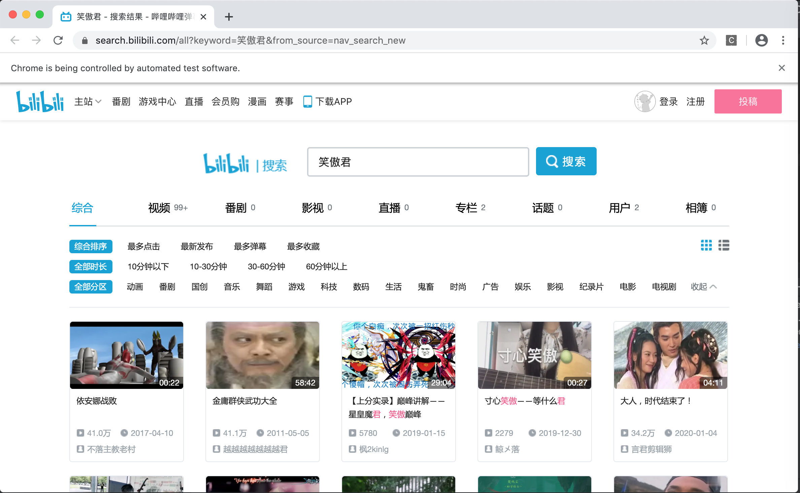
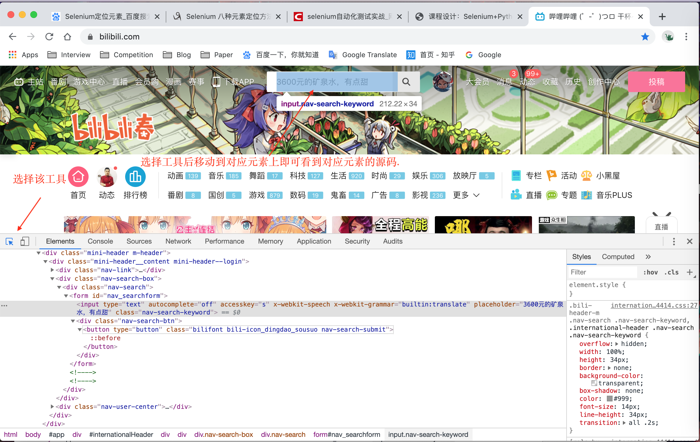

# 自动化Web测试

## 测试环境配置

### selenium配置

由于原先已经安装过python且在python3.7以后的版本中python自带对应的pip工具.

于是只需要pip install selenium即可.随后需要从[官网](http://www.seleniumhq.org/download/ )下载对应的驱动

在下载完驱动以后,通过在代码中指定executable_path即可实现自动化访问浏览器的目的.

### Web自动化测试

在自动化的测试部分我们采用[B站](https://www.bilibili.com/)进行测试.首先需要连接上对应的网址.然后是对网页内的各个元素进行分析,很靠谱的是Chrome可以用快速的工具查找到对应的元素内容.如图所示:



好,那在获取到了我们对应需要的元素文本内容之后,测试功能就显得简单了首先根据对应对象的类名来获取对应的元素,并通过向元素发送信息的方式来搜索对应的文本内容.然后找到对应的搜索键的元素名字并点击即可.



```python
driver = webdriver.Chrome(executable_path="./chromedriver")
driver.get("https://www.bilibili.com/")

"""测试基本的搜索内容."""
#输入对应的搜索内容.
search_content = driver.find_element_by_class_name("nav-search-keyword")
search_content.send_keys("笑傲君")

#点击搜索.
search_button = driver.find_element_by_class_name("nav-search-btn")
search_button.click()
```

对应得到的搜索出来的页面如下:


那么对应的接下来我们实现一个复杂一点的内容,通过搜索查到相应的视频并开始播放.由于具体的过程其实比较复杂,那么就直接上代码好了.首先要做的就是搜索对应的文本内容,这步比较简单就不展开讲了.

```python
# 输入对应的搜索内容,并搜索
driver.get("https://www.bilibili.com/")
driver.find_element_by_class_name("nav-search-keyword").send_keys("原来是笑傲菌殿下")
driver.find_element_by_class_name("nav-search-btn").click()
```

然后需要跳转到对应的另一个新的页面中需要采用语句去更新当前的driver对象.需要注意的是我们其中有一个步骤进行了浏览器当页的更新,因此需要对应更新driver对象,否则会出现找不到的现象.sleep的作用是为了能让页面先刷新出来.

```python
driver.switch_to.window(driver.window_handles[-1])  # 跳转到不同页面下的新页面.
driver.find_element_by_xpath('/html/body/div[3]/div/div[1]/div[2]/div/div[1]/div[3]/ul/li[8]/a').click()
time.sleep(1)  # 延长时间确保能捕捉到.
sreach_window = driver.current_window_handle #跳转当同一页面下的新页面
driver.find_element_by_link_text("刺客信条cg").click()
```

然后同样的跳转到新的页面,获取到新页面下的播放资源\<video\>并调用执行播放的语句即可.

```python
time.sleep(1)
driver.switch_to.window(driver.window_handles[-1])  # 跳转到搜索界面，否则会找不到.
video = WebDriverWait(driver, 30, 0.5).until(
  EC.presence_of_element_located((By.XPATH, '//*[@id="bilibiliPlayer"]/div[1]/div[1]/div[9]/video')))
#采用Web的等待机制，每隔0.5s查看一次,如果满足则执行下一步.
driver.execute_script("return arguments[0].play()", video)  # 开始播放
```

## 参考资料

[selenium+python实现bilibili视频播放测试](https://blog.csdn.net/u013948010/article/details/78537677?utm_source=blogxgwz0)

[selenium关于页面跳转](https://www.jianshu.com/p/6b9a19957aab)

